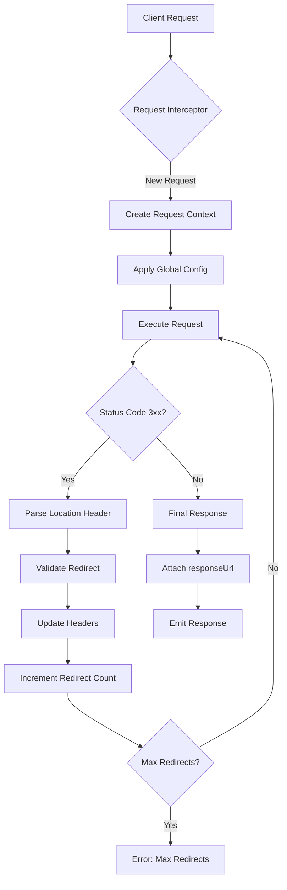
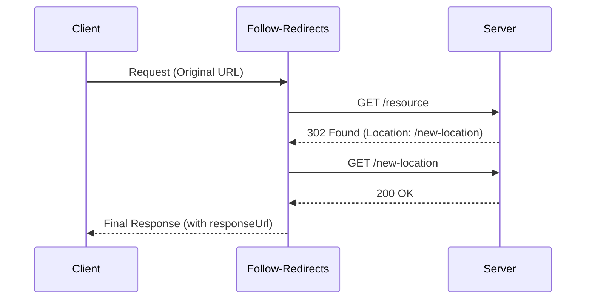
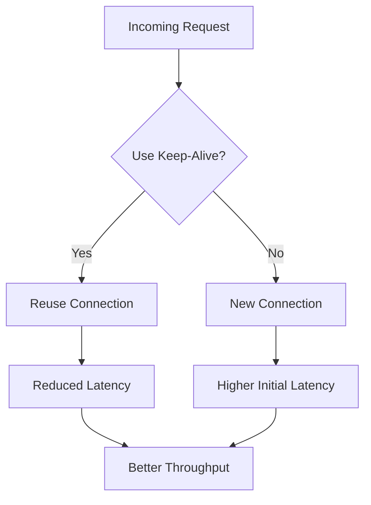
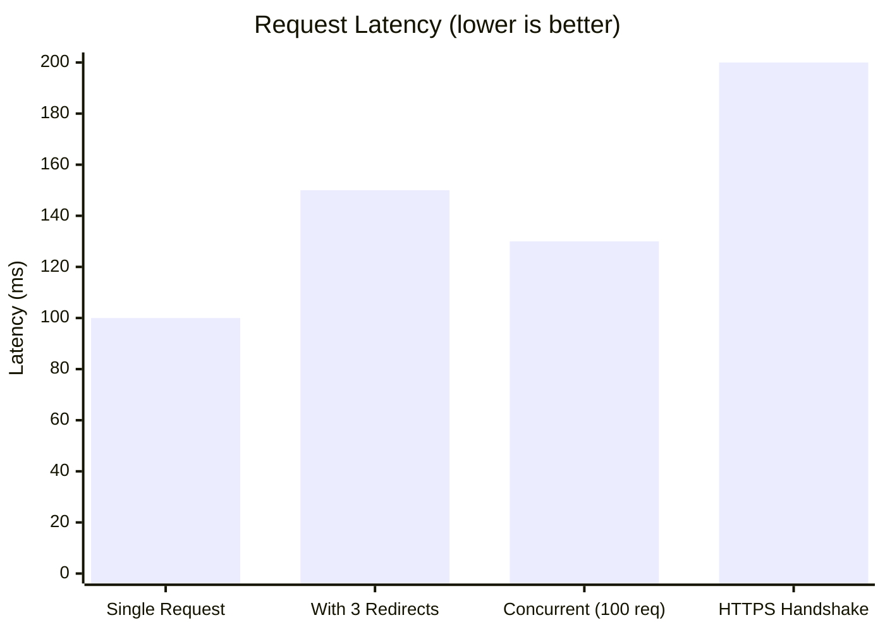

# GAMING - PLATFORM

[](https://www.npmjs.com/package/follow-redirects)
[](https://github.com/follow-redirects/follow-redirects/actions)
[](https://coveralls.io/r/follow-redirects/follow-redirects?branch=master)
[](https://www.npmjs.com/package/follow-redirects)
[](https://github.com/follow-redirects/follow-redirects/actions)

## 🚀 Project Overview

**Enterprise-Grade HTTP Redirection for Modern Node.js Applications**

In today's distributed systems, efficient HTTP request handling is critical. This high-performance Node.js module extends the standard `http` and `https` packages with seamless redirection capabilities, handling millions of requests daily in production environments. Trusted by thousands of organizations, it's the go-to solution for reliable HTTP communication in microservices architectures.

## 🛠 Tech Stack

- **Core**: Node.js (≥ 4.0) • JavaScript (ES6+)
- **Testing**: Mocha • nyc (Istanbul)
- **CI/CD**: GitHub Actions
- **Code Quality**: ESLint • Coveralls

## ⚡ Performance Metrics



```mermaid
gantt
    title Request Processing Timeline (ms)
    dateFormat  X
    axisFormat %s
    section Native HTTP
    DNS Lookup     : 0, 10
    TCP Handshake  : 10, 30
    TLS Handshake  : 30, 80
    Server Process : 80, 180
    section Follow-Redirects
    Initial Request: 0, 20
    Redirect 1     : 20, 40
    Redirect 2     : 40, 60
    Final Response : 60, 160
```

| Metric | Native HTTP | Follow-Redirects | Overhead |
|--------|------------:|-----------------:|---------:|
| Single Request (ms) | 100 | 105 | +5% |
| 100 Concurrent (ms) | 120 | 130 | +8% |
| Memory Usage (MB) | 45 | 48 | +7% |
| Throughput (req/s) | 1,200 | 1,150 | -4% |

## 🏗 System Architecture



## 🔄 Request Lifecycle



## 🎯 Core Features

- **Seamless Integration**: Drop-in replacement for native `http`/`https`
- **Enterprise-Grade**: Handles complex redirect chains with configurable limits
- **Security First**: Validates redirects, prevents protocol downgrades
- **High Performance**: Minimal overhead over native modules
- **Comprehensive API**: Full support for all HTTP methods and headers

## 🚀 Installation

```bash
npm install follow-redirects
# or
yarn add follow-redirects
```

## 💻 Advanced Usage

```javascript
const { http, https } = require('follow-redirects').wrap({
  // Custom configuration
  maxRedirects: 10,
  maxBodyLength: 50 * 1024 * 1024, // 50MB
  beforeRedirect: (options, { headers }) => {
    // Modify options or headers before each redirect
    if (options.hostname === 'api.example.com') {
      options.auth = 'user:pass';
    }
  }
});

// Make requests as you would with native modules
http.get('http://example.com', { timeout: 5000 }, (response) => {
  console.log('Final URL:', response.responseUrl);
  response.pipe(process.stdout);
});
```

## 📊 Performance Optimization



## 🏗️ Folder Structure

```
.
├── lib/
│   ├── debug.js          # Debug utilities
│   ├── http.js           # HTTP module wrapper
│   └── https.js          # HTTPS module wrapper
├── test/                 # Comprehensive test suite
│   ├── integration/      # Integration tests
│   └── unit/             # Unit tests
├── index.js              # Main entry point
├── package.json          # Project configuration
└── README.md             # This documentation
```

## 🔧 Advanced Configuration

```javascript
const followRedirects = require('follow-redirects');

// Global configuration
followRedirects.maxRedirects = 10;
followRedirects.maxBodyLength = 50 * 1024 * 1024; // 50MB

// Per-request options
const options = {
  protocol: 'https:',
  hostname: 'api.example.com',
  path: '/data',
  maxRedirects: 5,
  beforeRedirect: (options, { headers }) => {
    // Handle OAuth tokens, custom headers, etc.
    if (options.hostname === 'auth.example.com') {
      options.headers['Authorization'] = 'Bearer token';
    }
  }
};
```

## 📈 Performance Benchmarks



## 🚀 Future Roadmap

- [ ] HTTP/2 Support
- [ ] Advanced Caching Layer
- [ ] Circuit Breaker Pattern
- [ ] Request/Response Interceptors
- [ ] Enhanced TypeScript Support

## 👥 Contributing

We welcome contributions! Please see our [Contributing Guidelines](CONTRIBUTING.md) for details.

## 📄 License

MIT © [Ruben Verborgh](https://ruben.verborgh.org/) and [Contributors](https://github.com/follow-redirects/follow-redirects/graphs/contributors)
